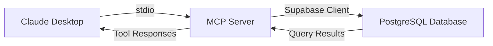

# Phase 4: Seed Data & Portfolio Polish - Research

**Researched:** 2026-02-08
**Domain:** Seed data generation, technical documentation, portfolio presentation
**Confidence:** HIGH

## Summary

Phase 4 packages the completed MCP server for Upwork portfolio presentation. The domain encompasses three areas: creating realistic seed data for demo purposes, documenting setup/usage in a README, and scripting a demo conversation that showcases capabilities.

The standard approach uses hand-crafted SQL seed files with believable fictional data (not random generators), README documentation following GitHub best practices with visual-first presentation, and natural conversation scripts that demonstrate problem-solving workflows rather than tool catalogs.

All code is already complete (Phases 1-3). This phase only creates presentation materials: seed data, README, and demo script. No new TypeScript implementation required.

**Primary recommendation:** Use Supabase seed.sql conventions (data-only, no schema statements), lead README with visual demo, structure conversation as problem-solving arc (discovery → diagnosis → action → verification).

## Standard Stack

### Core

| Library | Version | Purpose | Why Standard |
|---------|---------|---------|--------------|
| N/A | N/A | No libraries needed | This phase creates SQL, Markdown, and text files only |

### Supporting

| Tool | Purpose | When to Use |
|------|---------|-------------|
| Supabase SQL Editor | Execute seed.sql | Deploy seed data to Supabase project |
| Mermaid | Architecture diagrams in README | Render flow diagrams natively in GitHub |
| gen_random_uuid() | UUID generation in seed data | PostgreSQL built-in, no external deps |

### Alternatives Considered

| Instead of | Could Use | Tradeoff |
|------------|-----------|----------|
| Hand-crafted seed data | Faker.js / data generators | Generators create volume but lack narrative coherence; demos need story threads, not randomness |
| Mermaid diagrams | ASCII art or image files | Images don't render in dark mode, ASCII is hard to maintain; Mermaid is GitHub-native |
| Single README | Separate docs/ folder | Portfolio projects need quick-start simplicity; single file is better UX for prospects |

**Installation:**
No npm packages required. All tooling is PostgreSQL built-ins and GitHub rendering.

## Architecture Patterns

### Recommended Project Structure

```
seed/
├── seed.sql              # Data-only inserts, no schema statements
└── (no setup.md)        # Setup instructions live in README

README.md                # Single-file documentation:
                         # - Visual demo (screenshot/GIF) first
                         # - Feature list by entity
                         # - Architecture diagram (Mermaid)
                         # - Setup guide (Supabase project → seed → config)
                         # - Demo conversation script
                         # - Claude Desktop config example
```

### Pattern 1: Realistic Seed Data Generation

**What:** Hand-craft INSERT statements with believable fictional data using narrative threads

**When to use:** Demo databases for portfolio/client presentations where data needs to tell a story

**Example:**

```sql
-- Source: PopSQL Sample Dataset patterns
-- Create narrative threads - customer with related ticket journey
INSERT INTO customers (name, email, company, status) VALUES
  ('Sarah Chen', 's.chen@meridianlog.com', 'Meridian Logistics', 'active');

-- Related tickets showing issue progression
INSERT INTO tickets (customer_id, subject, status, created_at) VALUES
  ((SELECT id FROM customers WHERE email = 's.chen@meridianlog.com'),
   'Initial login issue', 'closed', now() - interval '14 days'),
  ((SELECT id FROM customers WHERE email = 's.chen@meridianlog.com'),
   'Follow-up: API access request', 'in_progress', now() - interval '3 days');
```

**Key principles:**
- Believable company names (sound real but aren't: "Meridian Logistics", "Cascade Health", "NovaBridge Software")
- Timestamp variety (3-6 month spread using `now() - interval 'X days'`)
- Narrative coherence (2-3 related tickets per customer showing problem evolution)
- Status/priority distribution (mix open/closed, varied priorities) for impressive analytics

**Source:** [PopSQL Sample Dataset](https://popsql.com/sql-templates/analytics/exploring-sample-dataset), [58 Fictional Company Names](https://medium.com/@evyborov/58-fictional-company-names-for-demo-e354c25c5297)

### Pattern 2: Supabase Seed File Convention

**What:** Data-only seed files without schema statements

**When to use:** All Supabase seed.sql files

**Structure:**

```sql
-- TechStart CRM Demo Data
-- Run this in Supabase SQL editor after creating tables

-- ALTER TABLE only for minor schema fixes (e.g., adding resolution column)
ALTER TABLE tickets ADD COLUMN IF NOT EXISTS resolution text;

-- Data inserts only - no CREATE TABLE statements
INSERT INTO customers (name, email, company, status) VALUES
  ('Alice Johnson', 'alice@example.com', 'Acme Corp', 'active');

-- Use subqueries for foreign key resolution
INSERT INTO tickets (customer_id, subject, status) VALUES
  ((SELECT id FROM customers WHERE email = 'alice@example.com'),
   'Login issue', 'open');
```

**Rationale:** Supabase best practice separates schema (migrations/DDL) from data (seed.sql). Keeps seed files focused and reusable.

**Source:** [Supabase Seeding Docs](https://supabase.com/docs/guides/local-development/seeding-your-database)

### Pattern 3: README Visual-First Structure

**What:** Lead with demo screenshot/GIF, then feature list, then setup

**When to use:** Portfolio projects targeting technical recruiters/clients

**Structure:**

```markdown
# Project Name

[Demo GIF showing Claude conversation with the MCP server]

**One-sentence hook** — what it does and why it matters

## Features

Grouped by domain entity:

### Customers
- list_customers - Filter by status or company
- get_customer - Retrieve by ID
[...]

### Architecture

[Mermaid diagram: Claude → MCP Server → Supabase]

## Setup

1. Create Supabase project
2. Run seed.sql
3. Add to claude_desktop_config.json
[...]

## Demo Conversation

**User:** What data do you have access to?
**Claude:** [Schema introspection response]
[5-7 exchanges showing problem-solving workflow]
```

**Rationale:** Prospects scan portfolio projects in 30 seconds. Visual + hook + features gets attention; setup details come after interest is established.

**Source:** [README Best Practices](https://medium.com/@sidragillani/best-practices-for-writing-readme-files-for-github-projects-fe89f76d0e02), [GitHub Portfolio 2026](https://www.analyticsinsight.net/career/how-to-create-a-strong-github-portfolio-in-2026-tips-to-showcase-your-skills)

### Pattern 4: Demo Conversation as Problem-Solving Arc

**What:** Structure demo script as discovery → diagnosis → action → verification

**When to use:** Demonstrating AI/agent capabilities in portfolio projects

**Example:**

```markdown
**User:** What's going on with our support queue today?
**Claude:** [Calls get_summary, reports stats]

**User:** Show me the urgent tickets
**Claude:** [Calls list_tickets with filter, presents results]

**User:** Let's close ticket #3 - we fixed the SSL issue
**Claude:** [Calls close_ticket with resolution, confirms]

**User:** Verify it's closed
**Claude:** [Calls get_ticket, shows closed status with timestamp]
```

**Structure:**
1. **Open-ended start** - "What's going on?" not "List tickets"
2. **Claude reasons** - Shows tool selection and data interpretation
3. **User acts on findings** - Takes action based on data (create, close, update)
4. **Verification** - Confirms action succeeded

**Rationale:** Clients want to see Claude *thinking* through problems, not just executing commands. Arc shows understanding → action → confirmation workflow.

**Source:** [Product Demo Script](https://www.storylane.io/blog/how-to-prepare-a-great-software-demo-presentation), [AI Portfolio Projects 2026](https://www.nucamp.co/blog/how-to-build-your-first-ai-project-in-2026-beginner-portfolio-ideas)

### Pattern 5: Mermaid Architecture Diagrams

**What:** Use Mermaid flowchart syntax in GitHub markdown for architecture diagrams

**When to use:** Showing system flow in README files (renders natively in GitHub)

**Example:**



**Syntax:**
- Wrap in triple-backtick mermaid code fence
- Use `graph LR` (left-right) or `graph TD` (top-down)
- `A[Label]` for nodes, `-->` for arrows, `|text|` for edge labels

**Rationale:** GitHub renders Mermaid natively (no image uploads), supports dark mode, easy to edit in markdown.

**Source:** [GitHub Mermaid Docs](https://docs.github.com/en/get-started/writing-on-github/working-with-advanced-formatting/creating-diagrams), [Mermaid Examples](https://github.blog/developer-skills/github/include-diagrams-markdown-files-mermaid/)

### Anti-Patterns to Avoid

- **Random test data generators** - Volume without narrative coherence; demos need believable stories
- **Schema statements in seed.sql** - Violates Supabase convention; separate DDL from data
- **Feature-list-first README** - Prospects need visual hook before reading feature lists
- **Tool catalog demo** - "Here are all my tools" is boring; show problem-solving workflow instead
- **Markdown badges** - Portfolio overkill; clean content speaks louder than badge clutter
- **Deep nested docs/** - Single README is faster for prospects; deep docs suggest complexity

## Don't Hand-Roll

| Problem | Don't Build | Use Instead | Why |
|---------|-------------|-------------|-----|
| Fake company names | Custom name generator | Hand-pick believable names | Generators create nonsense; 20 companies is small enough to curate |
| Timestamp distribution | Complex date logic | PostgreSQL `now() - interval 'X days'` | Built-in, readable, no external deps |
| UUID generation | String manipulation | `gen_random_uuid()` or INSERT with default | PostgreSQL handles it, maintains referential integrity |
| Architecture diagrams | Image editing tools | Mermaid in markdown | GitHub-native rendering, version-controllable, dark-mode friendly |
| Demo conversation | Actual Claude session transcript | Hand-written script | Scripts are cleaner, focused, no noise from real sessions |

**Key insight:** This phase is presentation, not engineering. Use simple built-ins (PostgreSQL functions, Mermaid markdown) over external tooling. Hand-craft small datasets (20 customers, 30 tickets) rather than generating large volumes.

## Common Pitfalls

### Pitfall 1: Schema Statements in seed.sql

**What goes wrong:** Seed file contains `CREATE TABLE` statements, violating Supabase convention

**Why it happens:** Developers copy database export dumps instead of extracting data-only inserts

**How to avoid:**
- Start seed.sql with comment: "Run this in Supabase SQL editor *after creating tables*"
- Include only INSERT statements and minor ALTER TABLE fixes
- Schema lives in CLAUDE.md or migration files, not seed.sql

**Warning signs:** File starts with `CREATE TABLE` or `DROP TABLE`

**Source:** [Supabase Seeding Docs](https://supabase.com/docs/guides/local-development/seeding-your-database)

### Pitfall 2: Foreign Key Orphans in Seed Data

**What goes wrong:** Ticket references customer UUID that doesn't exist; inserts fail with FK constraint error

**Why it happens:** Hardcoding UUIDs instead of using subquery resolution

**How to avoid:**
```sql
-- WRONG - hardcoded UUID breaks if customer doesn't exist
INSERT INTO tickets (customer_id, subject) VALUES
  ('550e8400-e29b-41d4-a716-446655440000', 'Login issue');

-- RIGHT - resolve customer ID dynamically
INSERT INTO tickets (customer_id, subject) VALUES
  ((SELECT id FROM customers WHERE email = 'alice@example.com'), 'Login issue');
```

**Warning signs:** Seed script fails halfway through with "violates foreign key constraint"

**Source:** PostgreSQL best practices, [W3Resource UUID Insert](https://www.w3resource.com/PostgreSQL/snippets/generating-uuid-for-insert-statement-postgresql.php)

### Pitfall 3: Generic Placeholder Data

**What goes wrong:** Seed data uses "Customer 1", "Company A", "Test ticket #5" - looks lazy in portfolio demos

**Why it happens:** Developer focuses on structure, not presentation

**How to avoid:**
- Invest 15 minutes curating realistic names: "Meridian Logistics", "Sarah Chen", "VPN connection drops"
- Add light narrative: customer with 2-3 related tickets showing issue evolution
- Vary statuses/priorities to make analytics impressive (not all "medium" priority)

**Warning signs:** Prospect thinks "this is a toy project" instead of "this is production-quality"

**Source:** [PopSQL Sample Dataset](https://popsql.com/sql-templates/analytics/exploring-sample-dataset)

### Pitfall 4: README Information Overload

**What goes wrong:** README leads with 10 paragraphs of context before showing what the project does

**Why it happens:** Developer writes for themselves (documentation) instead of prospects (portfolio)

**How to avoid:**
- Lead with visual (GIF/screenshot) showing Claude conversation
- One-sentence hook before any explanatory text
- Features list before setup details
- Demo conversation to show, not tell

**Warning signs:** Prospect bounces after reading intro paragraph without seeing what it does

**Source:** [README Best Practices](https://www.tilburgsciencehub.com/topics/collaborate-share/share-your-work/content-creation/readme-best-practices/)

### Pitfall 5: Boring Demo Script

**What goes wrong:** Demo conversation is just "List customers" → "Create ticket" → "Get product" - no story

**Why it happens:** Thinking of demo as tool catalog instead of workflow demonstration

**How to avoid:**
- Start open-ended: "What's going on today?" not "List tickets"
- Follow problem-solving arc: discover issue → investigate → take action → verify
- Show Claude reasoning: "Based on the analytics, I see 3 urgent tickets..."
- Include schema introspection: "What data do you have access to?" shows discovery

**Warning signs:** Reader thinks "OK, it has tools" instead of "Claude understands my business"

**Source:** [Product Demo Script](https://www.storylane.io/blog/how-to-prepare-a-great-software-demo-presentation)

## Code Examples

Verified patterns from official sources:

### PostgreSQL Timestamp Distribution for Seed Data

```sql
-- Source: PostgreSQL interval arithmetic
-- Spread customer signups over 6 months
INSERT INTO customers (name, email, created_at) VALUES
  ('Alice', 'alice@example.com', now() - interval '180 days'),
  ('Bob', 'bob@example.com', now() - interval '120 days'),
  ('Carol', 'carol@example.com', now() - interval '45 days'),
  ('Dan', 'dan@example.com', now() - interval '10 days');

-- Tickets across timeline
INSERT INTO tickets (customer_id, subject, created_at) VALUES
  ((SELECT id FROM customers WHERE email = 'alice@example.com'),
   'Initial issue', now() - interval '90 days'),
  ((SELECT id FROM customers WHERE email = 'alice@example.com'),
   'Follow-up', now() - interval '7 days');
```

### Mermaid Architecture Diagram

```markdown
<!-- Source: GitHub Mermaid documentation -->
```mermaid
graph LR
    A[Claude Desktop] -->|MCP stdio| B[Node.js MCP Server]
    B -->|@supabase/supabase-js| C[(Supabase PostgreSQL)]
    C -->|Query Results| B
    B -->|Tool Responses| A

    style A fill:#f9f,stroke:#333
    style B fill:#bbf,stroke:#333
    style C fill:#bfb,stroke:#333
```\
```

### README Demo Conversation Section

```markdown
<!-- Source: Portfolio best practices -->
## Demo Conversation

This shows a typical workflow: checking the support queue, investigating an urgent issue, taking action, and verifying the result.

**User:** What's going on with our support queue today?

**Claude:** Let me check the analytics dashboard.

*[Calls get_summary tool]*

I can see you have 7 open tickets across 6 customers. Breaking down by priority:
- 2 urgent tickets (SSL certificate expired, data recovery request)
- 3 high priority (email access, VPN connection issues)
- 2 medium priority (license renewal, software setup)

The urgent SSL certificate issue for SolveWare should probably be addressed first.

**User:** Show me that SSL ticket in detail

**Claude:** *[Calls get_ticket]*

Here's the urgent SSL ticket (#8):
- Customer: Iris Chen from SolveWare
- Subject: Website SSL certificate
- Description: "SSL certificate expired, website showing security warnings"
- Created: 2 hours ago
- Status: Open

**User:** We fixed that issue. Close the ticket and note that we renewed the certificate through Let's Encrypt.

**Claude:** *[Calls close_ticket with resolution: "Renewed SSL certificate through Let's Encrypt. Certificate is now valid for 90 days. Configured auto-renewal to prevent future expirations."]*

Done! I've closed ticket #8 and recorded the resolution. The ticket now shows:
- Status: Closed
- Closed at: [timestamp]
- Resolution: Renewed SSL certificate through Let's Encrypt...

**User:** Perfect. What's our open ticket count now?

**Claude:** *[Calls get_summary]*

Down to 6 open tickets. Great work resolving that urgent issue!
```

### Claude Desktop Config Example

```json
// Source: MCP Server integration patterns
{
  "mcpServers": {
    "techstart-crm": {
      "command": "node",
      "args": ["C:/Users/YourName/upwork-mcp-server/dist/index.js"],
      "env": {
        "SUPABASE_URL": "https://your-project-id.supabase.co",
        "SUPABASE_SERVICE_ROLE_KEY": "your-service-role-key-here"
      }
    }
  }
}
```

## State of the Art

| Old Approach | Current Approach | When Changed | Impact |
|--------------|------------------|--------------|--------|
| README badges (build status, coverage, etc.) | Clean content-focused README | ~2024 | Portfolio projects emphasize substance over decoration |
| Static architecture diagrams (PNG/SVG) | Mermaid in markdown | 2023+ | GitHub native support, dark mode, version control friendly |
| UUID v4 (random) for primary keys | UUID v7 (time-ordered) for write-heavy tables | 2024 | Better index performance, but v4 still fine for small demos |
| Faker.js for test data | Hand-crafted realistic data | N/A | Demos need narrative, not volume |
| Multi-file documentation (docs/ folder) | Single README for portfolio projects | N/A | Quick-start simplicity beats comprehensive docs for demos |

**Deprecated/outdated:**
- **README badges** - Common in open-source, overkill for portfolio projects
- **Separate ARCHITECTURE.md files** - Single README with Mermaid diagram is cleaner for demos
- **Auto-generated seed data** - Volume over quality; 20 believable records beats 1000 random ones

## Open Questions

1. **GIF vs Screenshot for README**
   - What we know: Both are effective; GIFs show interaction, screenshots are simpler
   - What's unclear: Optimal length for demo GIF (5 seconds? 15 seconds? 30 seconds?)
   - Recommendation: Start with screenshot (easier to produce), upgrade to GIF if time permits; 10-15 second GIF showing one complete interaction (question → tool call → response)

2. **Schema in README vs Separate File**
   - What we know: CLAUDE.md contains schema DDL, resources/schema.ts has programmatic definition
   - What's unclear: Should README include CREATE TABLE statements for prospect reference?
   - Recommendation: Include condensed schema in README (table names + key columns), link to CLAUDE.md for full DDL; makes setup self-contained

3. **Demo Conversation Specificity**
   - What we know: Problem-solving arc is more engaging than tool catalog
   - What's unclear: Should script show exact tool call syntax or just Claude's natural responses?
   - Recommendation: Show both - natural conversation with `*[Calls tool_name]*` annotations to clarify what's happening under the hood

## Sources

### Primary (HIGH confidence)

- [Supabase Seeding Documentation](https://supabase.com/docs/guides/local-development/seeding-your-database) - Seed file best practices
- [GitHub Mermaid Documentation](https://docs.github.com/en/get-started/writing-on-github/working-with-advanced-formatting/creating-diagrams) - Architecture diagram patterns
- [PostgreSQL UUID Tutorial](https://neon.com/postgresql/postgresql-tutorial/postgresql-uuid) - UUID generation methods
- [MCP Servers Repository](https://github.com/modelcontextprotocol/servers) - Reference implementation documentation patterns

### Secondary (MEDIUM confidence)

- [README Best Practices - Tilburg Science Hub](https://www.tilburgsciencehub.com/topics/collaborate-share/share-your-work/content-creation/readme-best-practices/) - Technical documentation structure
- [Best Practices for GitHub README Files](https://medium.com/@sidragillani/best-practices-for-writing-readme-files-for-github-projects-fe89f76d0e02) - Portfolio README patterns
- [How to Create a Strong GitHub Portfolio in 2026](https://www.analyticsinsight.net/career/how-to-create-a-strong-github-portfolio-in-2026-tips-to-showcase-your-skills) - Portfolio presentation strategies
- [PopSQL Sample Dataset](https://popsql.com/sql-templates/analytics/exploring-sample-dataset) - Realistic B2B SaaS seed data example
- [58 Fictional Company Names for Demo](https://medium.com/@evyborov/58-fictional-company-names-for-demo-e354c25c5297) - Believable company name curation
- [How to Prepare a Great Software Demo Presentation](https://www.storylane.io/blog/how-to-prepare-a-great-software-demo-presentation) - Demo conversation arc patterns

### Tertiary (LOW confidence)

- Web search results for "demo conversation script portfolio project examples 2026" - General guidance, not MCP-specific
- Web search results for "Claude AI conversation examples MCP tools demo 2026" - MCP integration overview

## Metadata

**Confidence breakdown:**
- Seed data patterns: HIGH - Supabase docs + PostgreSQL built-ins are authoritative
- README structure: MEDIUM - Best practices consensus across sources, but no single standard
- Demo conversation: MEDIUM - Pattern synthesis from demo script best practices, not MCP-specific examples
- Mermaid diagrams: HIGH - Official GitHub documentation with examples

**Research date:** 2026-02-08
**Valid until:** 60 days (stable domain - SQL, markdown, documentation patterns evolve slowly)
