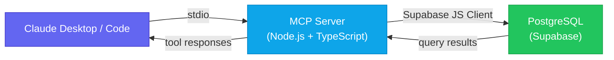

# TechStart CRM — MCP Server

> Connect your business database to Claude using the Model Context Protocol.
> Natural language queries, CRUD operations, and analytics — all through conversation.

---

## Architecture



Claude communicates with the MCP server over stdio. The server translates natural language tool calls into Supabase queries and returns structured results that Claude interprets for the user.

---

## Features

### Customers

| Tool | Description |
|------|-------------|
| `list_customers` | List all customers, optionally filter by status or company name |
| `get_customer` | Get a single customer by ID, including open/total ticket counts and recent tickets |
| `create_customer` | Add a new customer with name, email, optional company and status |
| `update_customer` | Update any combination of customer fields by ID |

### Tickets

| Tool | Description |
|------|-------------|
| `list_tickets` | List tickets with filters by status, priority, customer ID, or customer name |
| `get_ticket` | Get full ticket details including linked customer information |
| `create_ticket` | Create a support ticket linked by customer ID or customer name lookup |
| `close_ticket` | Mark a ticket as resolved with an optional resolution note |

### Products

| Tool | Description |
|------|-------------|
| `list_products` | List all products with formatted pricing |
| `search_products` | Search products by name, category, or description |

### Analytics

| Tool | Description |
|------|-------------|
| `get_summary` | Dashboard stats: customer counts by status, ticket breakdown by priority, product catalog value by category, recent activity |

### Schema Introspection

| Resource | URI | Description |
|----------|-----|-------------|
| Database schema | `schema://tables` | Full schema for all tables including columns, types, constraints, and relationships |

---

## Tech Stack

- **Runtime:** Node.js + TypeScript
- **MCP SDK:** @modelcontextprotocol/sdk
- **Database:** Supabase (PostgreSQL)
- **Validation:** Zod
- **Linter/Formatter:** Biome
- **Transport:** stdio

---

## Setup

### 1. Clone and install

```bash
git clone https://github.com/voyagi/upwork-mcp-server.git
cd upwork-mcp-server
npm install
```

### 2. Create a Supabase project

Go to [supabase.com](https://supabase.com) and create a new project. Open the **SQL Editor** and run the following to create the tables:

```sql
create table customers (
  id uuid primary key default gen_random_uuid(),
  name text not null,
  email text not null unique,
  company text,
  status text not null default 'active'
    check (status in ('active', 'inactive', 'lead')),
  created_at timestamptz default now()
);

create table products (
  id uuid primary key default gen_random_uuid(),
  name text not null,
  category text not null,
  price_cents integer not null,
  description text,
  created_at timestamptz default now()
);

create table tickets (
  id uuid primary key default gen_random_uuid(),
  customer_id uuid references customers(id) on delete cascade,
  subject text not null,
  description text,
  status text not null default 'open'
    check (status in ('open', 'in_progress', 'closed')),
  priority text not null default 'medium'
    check (priority in ('low', 'medium', 'high', 'urgent')),
  resolution text,
  created_at timestamptz default now(),
  closed_at timestamptz
);
```

Then run the contents of `seed/seed.sql` to populate the database with 22 customers, 12 products, and 32 support tickets.

### 3. Configure environment

```bash
cp .env.example .env
```

Fill in your Supabase credentials from the **Connect dialog** (or Project Settings > API Keys):

- `SUPABASE_URL` — your project URL (e.g., `https://abcdefg.supabase.co`)
- `SUPABASE_SECRET_KEY` — the service role key (not the anon key)

### 4. Build and run

```bash
npm run build
npm start
```

The server starts listening on stdio. To verify it works, connect it to Claude Desktop (see below).

---

## Claude Desktop Integration

Add the following to your Claude Desktop config file:

- **macOS:** `~/Library/Application Support/Claude/claude_desktop_config.json`
- **Windows:** `%APPDATA%\Claude\claude_desktop_config.json`

```json
{
  "mcpServers": {
    "techstart-crm": {
      "command": "node",
      "args": ["/absolute/path/to/upwork-mcp-server/dist/index.js"],
      "env": {
        "SUPABASE_URL": "https://your-project-id.supabase.co",
        "SUPABASE_SECRET_KEY": "your-service-role-key-here"
      }
    }
  }
}
```

Replace `/absolute/path/to/upwork-mcp-server` with the actual path where you cloned the repository, and fill in your Supabase credentials.

---

## Demo Conversation

Once connected, try a conversation like this:

**User:** What data do you have access to?

**Claude:** *[Reads schema://tables]*
I have access to a CRM database with three tables: **customers** (name, email, company, status), **tickets** (subject, priority, status, linked to customers), and **products** (name, category, pricing). I can query, create, and update records across all of them.

**User:** How are things looking today?

**Claude:** *[Calls get_summary]*
Here is your dashboard overview:

- **Customers:** 22 total — 15 active, 4 inactive, 3 leads
- **Tickets:** 32 total — 23 open (4 urgent, 7 high priority), 9 closed
- **Products:** 12 items across 3 categories, total catalog value of $2,348.00
- **This week:** 2 new customers signed up, 0 tickets resolved

The 4 urgent tickets should be your first priority.

**User:** Show me the urgent tickets.

**Claude:** *[Calls list_tickets with status: "open", priority: "urgent"]*
There are 4 urgent open tickets:

1. **URGENT: data export blocking quarterly report** — Apex Manufacturing (Marcus Reed), created 1 day ago
2. **SSL certificate renewal failing** — Ironclad Security (David Kim), created 2 days ago
3. **Checkout integration dropping orders during peak hours** — Velvet Retail (Amira Hassan), created 2 days ago
4. **Suspicious login attempts from unknown IPs** — Ironclad Security (David Kim), created 1 day ago

The SSL certificate issue is customer-facing — want me to look into any of these?

**User:** Close the SSL ticket. We renewed the certificate and updated the configuration.

**Claude:** *[Calls close_ticket with resolution: "SSL certificate renewed and server configuration updated. Verified HTTPS connectivity restored."]*
Done. The SSL certificate ticket for Ironclad Security has been closed with your resolution note. That brings your urgent count down to 3.

**User:** Before we onboard them — what integration options do we offer?

**Claude:** *[Calls search_products with query: "integration"]*
We have two integration-related products:

1. **API Access** — $79.00/mo — REST and GraphQL API access, 10K requests/day, webhook integrations
2. **Custom Integrations** — $149.00/mo — Custom API integrations with your existing tools (Salesforce, HubSpot, Jira, etc.)

The API Access add-on covers standard integrations. If they need connections to specific internal systems, the Custom Integrations package includes hands-on setup.

**User:** We just signed Pinnacle Retail as a new customer. Contact is Dana Park, dana@pinnacleretail.com.

**Claude:** *[Calls create_customer with name: "Dana Park", email: "dana@pinnacleretail.com", company: "Pinnacle Retail"]*
Created. Dana Park from Pinnacle Retail has been added as an active customer. Would you like to create a welcome ticket or onboarding task for them?

**User:** What is the updated summary now?

**Claude:** *[Calls get_summary]*
Updated numbers after your changes:

- **Customers:** 23 total — 16 active, 4 inactive, 3 leads (up from 22)
- **Tickets:** 32 total — 22 open (3 urgent, 7 high), 10 closed
- **This week:** 3 new customers, 1 ticket resolved

One fewer urgent ticket and one more customer compared to a few minutes ago. The 3 remaining urgent tickets are the data export blocking quarterly report (Marcus Reed), checkout integration dropping orders (Amira Hassan), and suspicious login attempts (David Kim).

---

## Database Schema

```sql
-- Customers: name, email, company, status (active/inactive/lead)
create table customers (
  id            uuid primary key default gen_random_uuid(),
  name          text not null,
  email         text not null unique,
  company       text,
  status        text not null default 'active'
                check (status in ('active', 'inactive', 'lead')),
  created_at    timestamptz default now()
);

-- Products: catalog with pricing in cents
create table products (
  id            uuid primary key default gen_random_uuid(),
  name          text not null,
  category      text not null,
  price_cents   integer not null,
  description   text,
  created_at    timestamptz default now()
);

-- Tickets: support tickets linked to customers
create table tickets (
  id            uuid primary key default gen_random_uuid(),
  customer_id   uuid references customers(id) on delete cascade,
  subject       text not null,
  description   text,
  status        text not null default 'open'
                check (status in ('open', 'in_progress', 'closed')),
  priority      text not null default 'medium'
                check (priority in ('low', 'medium', 'high', 'urgent')),
  resolution    text,
  created_at    timestamptz default now(),
  closed_at     timestamptz
);
```

---

## Development

```bash
npm run dev      # Run with hot reload (tsx watch)
npm run build    # Compile TypeScript
npm run start    # Run compiled version
npm run check    # Biome lint + format
```

---

## License

MIT
